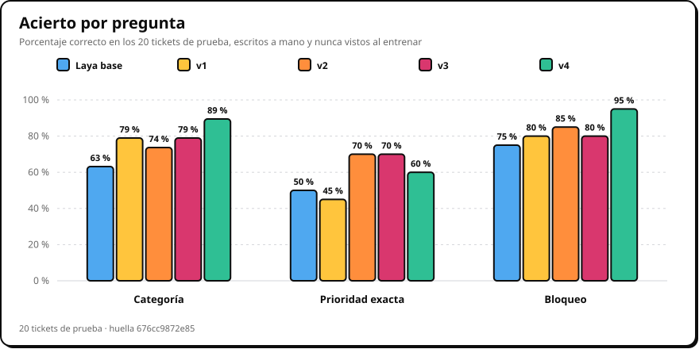
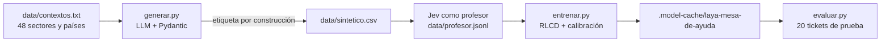

<div align="center">

# Laya Finetune

**Laya Multilingual especializada en clasificar tickets de soporte: datos sintéticos, entrenamiento RLCD y evaluación.**

Laya decide en una sola pasada, sin generar texto y en unos 10 ms, pero de fábrica acierta la categoría de 12 de
cada 19 tickets. Este repo la especializa en la mesa de ayuda con miles de tickets sintéticos etiquetados por
construcción y un LLM como profesor, y mide el resultado contra tickets escritos a mano que nunca ve al entrenar.

[](#empezar)
[](https://huggingface.co/convaiinnovations/laya-multilingual)
[](#entrenamiento)
[](https://github.com/zamax14/Laya-Showcase)
[](LICENSE)



</div>

## La tarea

Un ticket entra como estado y Laya responde tres preguntas tipadas en una sola pasada:

| Pregunta | Tipo | Opciones |
|---|---|---|
| ¿Qué equipo lo atiende? | `choice` | hardware, software, redes, accesos, correo y colaboración, seguridad |
| ¿Qué prioridad tiene? | `score` | baja, media, alta, crítica |
| ¿Alguien no puede trabajar ahora mismo? | `noul` | sí o no, con su probabilidad |

La confianza de la categoría alimenta un **semáforo**: verde (más de 80 %) se asigna solo, amarillo lo confirma una
persona y rojo lo decide una persona. Por eso importa tanto acertar como que la confianza avise cuando duda.

## Resultados

Los **20 tickets de prueba** están escritos a mano, con detalles reales y sin pistas de la respuesta, y nunca entran
al entrenamiento: son los mismos del benchmark de [Pondera](https://github.com/zamax14/Laya-Showcase). La validación
son casos generados que tampoco se entrenan.

| Modelo | Casos de entrenamiento | Categoría | Prioridad exacta | Bloqueo | ECE | Latencia |
|---|---|---|---|---|---|---|
| Laya base | sin ajustar | 12/19 | 10/20 | 15/20 | 0,229 | 10 ms |
| v1 | 720 · gemma3, 1 contexto | 15/19 | 9/20 | 16/20 | 0,18 | 10 ms |
| v2 | 1.260 · + 5 sectores y países | 14/19 | 14/20 | 17/20 | 0,186 | 10 ms |
| v3 | 1.470 · + 210 de seguridad con señales | 15/19 | 14/20 | 16/20 | 0,133 | 10 ms |
| **v4** | 11.837 · + 10.151 de GPT-5.6 Luna, 48 contextos | **17/19** | 12/20 | **19/20** | 0,131 | 10 ms |
| *Jev 1.13* | *por API* | *19/19* | *13/20* | *19/20* | | *366 ms* |
| *GPT-5.6 Luna* | *por API* | *19/19* | *15/20* | *19/20* | | *1.896 ms* |

- **v4 acierta 17 de 19 categorías y 19 de 20 bloqueos**, a 10 ms por ticket en una GPU de escritorio: el bloqueo
  empata con Jev y GPT, que tardan entre 35 y 190 veces más y cobran por llamada. Resolvió el fraude
  («alguien aprobó un pago con mi usuario») y las llamadas de Teams, que todas las versiones anteriores fallaban.
- **Sus dos errores salen en verde, con mucha confianza:** «el CRM no carga y la red va lenta» como software al
  97 % (la causa es la red) y «cambiar el fondo de pantalla» como hardware al 92 %. El ticket ambiguo a propósito
  («no me funciona nada») sale en amarillo: pide revisión, pero ya no en rojo como la base.
- **La prioridad es lo más difícil** (60 a 70 %). A ±1 nivel acierta 20 de 20: duda entre niveles vecinos.
- La **ECE** mide cuánto se aleja la confianza de la categoría de su acierto real (0 es perfecto): baja de 0,23 a
  0,13. Jev y GPT se midieron en [Pondera](https://github.com/zamax14/Laya-Showcase) con los mismos tickets; GPT
  declara sus probabilidades en lugar de medirlas.

Generar los ~11.800 casos y etiquetarlos con Jev costó unos **US$3,50**. El entrenamiento completo de v4 tardó
unos 20 minutos (4 épocas de ~5 min) en una RTX 4070 Ti SUPER con 6 GB de VRAM.

## Cómo funciona



### Datos sintéticos

Escribir miles de tickets a mano con su respuesta no escala, y pedirle a un LLM que los clasifique después tampoco:
hereda sus errores. `generar.py` lo hace al revés: **decide la respuesta y le pide al LLM un ticket que la tenga**.

- **Combinaciones.** Cada llamada es para una combinación fija de categoría × prioridad × bloqueo (36; baja y media
  nunca bloquean), repartidas por igual, así que la etiqueta se conoce sin leer el texto.
- **Contexto.** `--prompt` o un archivo con uno por línea cambia el sector, el país, quién escribe y el formato:
  hospital en México, banco en España, planta en Colombia, chat de una universidad en Argentina… 48 en total.
- **Señales.** El prompt exige que los hechos basten para elegir el equipo sin nombrarlo: un correo que pide la
  contraseña, una alerta del antivirus, un pago que nadie reconoce.
- **Formato.** Un modelo de Pydantic genera el JSON Schema que restringe la salida y valida cada lote: texto libre,
  campos vacíos o descripciones de menos de 25 palabras se descartan enteros.
- **Filtros.** Se descartan las frases que delatan la respuesta («no es un fallo de…»), el nombre de la propia
  categoría y los títulos repetidos o copiados de los tickets de prueba.

| Backend | Modelo | Medido en esta tarea | Costo |
|---|---|---|---|
| Ollama, local | `gemma3:12b` en una RTX 4070 Ti SUPER | ~12 tickets por minuto | gratis |
| OpenRouter | `openai/gpt-5.6-luna` | 216 tickets en ~44 s con 18 hilos | ~US$0,30 por 1.000 |
| OpenAI | `gpt-6-luna` | ~5 s por llamada | respaldo automático si OpenRouter se queda sin saldo |

### Profesor

Jev, un modelo de decisión de pago, responde las mismas tres preguntas sobre cada caso (unos US$0,04 por 1.000). Su
distribución **suaviza el objetivo** (70 % la etiqueta pedida, 30 % Jev), así Laya aprende también cuánta duda es
razonable, y los casos que Jev no ve en la categoría pedida **se descartan**. Las respuestas quedan en
`data/profesor.jsonl` y solo se pagan las nuevas. Sin llave, o con `--sin-profesor`, la etiqueta se suaviza al 90 %.

### Entrenamiento

La receta es la del [notebook oficial de Laya](https://github.com/NandhaKishorM/laya/blob/main/notebooks/laya_finetune_typed_decisions_2xT4_kaggle.ipynb),
en una sola GPU: **RLCD**, que saca 4 versiones con ruido de cada distribución, las premia con reglas de puntuación
propias (log, esférica y RPS para `score`) y suma la entropía cruzada suave. Reparte los casos 80 / 10 / 10 entre
entrenamiento, calibración y validación, guarda la mejor época según la validación y ajusta una temperatura por tipo
de pregunta con los casos apartados, porque `laya-multilingual` viene sin calibrar.

| Perfil | Casos | Épocas | Qué se entrena | GPU |
|---|---|---|---|---|
| `prueba` (por defecto) | 2 por combinación (72) | 1 | 6 capas superiores y la cabeza (~45 M) | tope duro de 3 GB |
| `--completo` | todos | 4 (`--epocas`) | todo el modelo (322 M) | ~6 GB, pensada para 12 GB o más |

## Empezar

```bash
git clone git@github.com:zamax14/Laya-Finetune.git
cd Laya-Finetune
python3 -m venv .venv
.venv/bin/pip install -r requirements.txt
```

Las llaves van en variables de entorno o en archivos de la raíz, ignorados en git: `openrouter`
(`OPENROUTER_API_KEY`, para generar con GPT y para Jev), `OPENAI` (`OPENAI_API_KEY`, respaldo) y `HF_TOKEN`
(opcional).

```bash
# 1. Datos: el dataset de los resultados (~10.000 casos, ~35 min, ~US$3), o gratis con Ollama.
.venv/bin/python generar.py --backend openrouter --contextos data/contextos.txt --n 216 --hilos 18
.venv/bin/python generar.py --prompt "incidencias de TI de un hospital en México" --n 200

# 2. Entrenamiento: prueba corta (≤ 3 GB) o completo.
.venv/bin/python entrenar.py
.venv/bin/python entrenar.py --completo

# 3. Evaluación de cualquier checkpoint contra los 20 tickets de prueba.
.venv/bin/python evaluar.py base ajustada=.model-cache/laya-mesa-de-ayuda
```

El checkpoint queda en `.model-cache/laya-mesa-de-ayuda/` en el formato normal de Laya (`laya.load(ruta)`), con sus
cifras en `resultados.json`. `evaluar.py` guarda la comparación en `resultados/evaluacion.json` y dibuja
`docs/evaluacion.svg`.

## Notebooks

| Notebook | Qué hace |
|---|---|
| [`01_datos_sinteticos`](notebooks/01_datos_sinteticos.ipynb) | cómo se construye un caso, un lote de ejemplo y la composición del dataset |
| [`02_entrenamiento`](notebooks/02_entrenamiento.ipynb) | la receta RLCD, la prueba corta y el entrenamiento completo |
| [`03_evaluacion`](notebooks/03_evaluacion.ipynb) | la comparación entre versiones, qué cambió ticket por ticket y una celda para probar tickets propios |

Llaman a los scripts; el código vive en los módulos probados.

## Lo que aprendimos

- **La etiqueta por construcción necesita señales.** Pedirle a gemma3 un ticket de seguridad «sin nombrar la
  categoría» producía carpetas lentas y licencias vencidas, sin rastro de ataque: Jev rechazó 88 de 210 (42 %).
  Exigir en el prompt las señales de cada categoría lo subió a 201 de 210, y en el dataset de v4 Jev coincide con la
  etiqueta pedida en el 98 % de los casos.
- **Un profesor sirve sobre todo para filtrar.** Descartar los casos que Jev no ve en su categoría evita entrenar con
  tickets que no dicen lo que su etiqueta dice.
- **Más estilos de escritura ganan a más casos del mismo estilo.** v2 añadió contextos y v3 casos de seguridad, sin
  mover la categoría de 15 de 19. v4 sumó 10.000 casos de otro modelo en 48 contextos y llegó a 17.
- **La validación sobreestima.** v4 acierta 1.158 de 1.160 categorías en validación y 17 de 19 en los tickets de
  prueba: los casos generados se parecen entre sí más que a los escritos por una persona. Por eso se mide siempre
  contra los 20 tickets de prueba.
- **No todo LLM local sirve para generar.** `qwen3.5:9b` ignora el esquema si no razona, y razonando tardó 148 s en
  devolver una respuesta vacía. `gemma3:12b` respeta el esquema, a unos 12 tickets por minuto.
- **Criterios cortos, contexto rico.** Con Laya, criterios de categoría cortos y con palabras clave aciertan más
  que criterios largos con reglas de desempate (13 frente a 10 de 19); el detalle rinde en el ticket.
- **El contexto largo aún no está entrenado.** Laya admite 8.192 tokens, pero se ajustó con tickets de menos de 412.
  Con el mismo ticket al inicio de un hilo de correo de 8k tokens, la categoría se sostiene y la prioridad cae a la
  mitad ([benchmark de contexto largo](https://github.com/zamax14/Laya-Showcase)). El siguiente paso es generar
  tickets largos: hilos, logs pegados, correos con historial.


## Estructura

```
├── tarea.py         la tarea: categorías, prioridades, las tres preguntas y los 20 tickets de prueba
├── modelo.py        carga de Laya (Hugging Face o checkpoint local) con contexto de 8192 tokens
├── llm.py           cliente HTTP, forma de las respuestas y Jev como profesor
├── generar.py       tickets sintéticos etiquetados por construcción, con Ollama, OpenRouter u OpenAI
├── entrenar.py      fine-tune RLCD, calibración y comparación contra la base
├── evaluar.py       métricas, tabla y gráfica con los 20 tickets de prueba
├── data/            contextos para generar; el CSV y las respuestas del profesor quedan fuera de git
├── notebooks/       los tres pasos, explicados
├── resultados/      la última evaluación
├── docs/            gráficas de este README
└── tests/           pruebas sin red ni GPU
```

## Pruebas

```bash
.venv/bin/python -m unittest discover -s tests -t .
```

Cubren la tarea y los tickets de prueba (referencias válidas y sin pistas), el generador con un LLM falso (reparto,
filtros, CSV, validación con Pydantic y cambio de proveedor sin saldo), los objetivos y el reparto del
entrenamiento, y las métricas y la gráfica de la evaluación.

## Créditos

- **[Laya Multilingual](https://huggingface.co/convaiinnovations/laya-multilingual)** de ConvAI Innovations,
  Apache-2.0, y su [receta de fine-tune](https://github.com/NandhaKishorM/laya). Los pesos se descargan de Hugging Face.
- **Jev** de TypeSafe y **GPT** de OpenAI, vía [OpenRouter](https://openrouter.ai).
- **Tickets de prueba y contextos** redactados con Claude; los tickets sintéticos, con gemma3 y GPT.
- **Código** bajo licencia [MIT](LICENSE).
