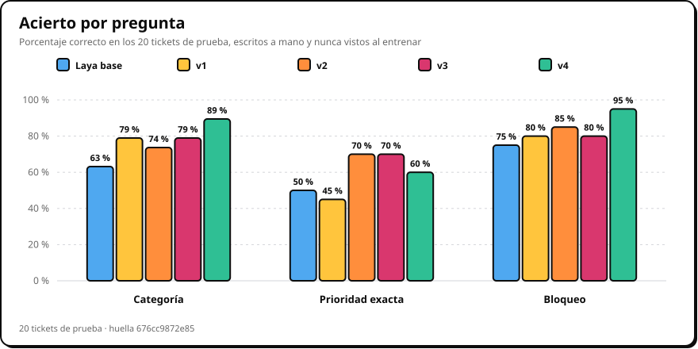

<div align="center">

# Laya Finetune

**Fine-tune Laya, the open System One decision model, for any typed-decision task: synthetic data from any LLM,
RLCD with a teacher, calibration, and context from 1k up to 64k tokens.**

Laya answers typed questions about a state in one forward pass, without generating text, in ~10–30 ms. Out of the
box it is a generalist; this framework specializes it on your task the way Ultralytics trains YOLO: describe the task
in a YAML file, then `generate`, `train` and `val` from one command or one function.

[](#install)
[](https://huggingface.co/convaiinnovations/laya-multilingual)
[](#install)
[](LICENSE)

</div>

```bash
layaft generate task=helpdesk backend=ollama n=216 context=all     # cases labelled by construction
layaft train task=helpdesk profile=full ctx=16k                    # RLCD + calibration → runs/helpdesk-16k
layaft val task=helpdesk model=runs/helpdesk-16k ctx=16k           # hand-written test set, by length
```

## Laya and Jev

[Jev](https://typesafe.ai/blog/introducing-system-one-models-and-jev) (TypeSafe, September 2026) opened the category
of **System One models**. They do not write text: given a state and typed questions (`choice`, `score`, `noul`),
they return typed answers with calibrated probabilities. They are trained with RLCD (reinforcement learning for
calibrated decisions) on synthetic data only. [Laya](https://github.com/NandhaKishorM/laya) is its open reproduction
(Apache-2.0), speaks the same `/v1/systemone` contract and runs on your own GPU.

| | Jev 1.13 | Laya multilingual | Laya english |
|---|---|---|---|
| Weights | closed, API | open, 322M (mmBERT-base) | open, 421M (ModernBERT-large) |
| Context | ~32k state + longest question, ~64k with all questions | 1,024 (8,192 positions) | 512 (8,192 positions) |
| Latency | 70–500 ms | ~10–30 ms on a desktop GPU | ~30 ms on a T4 |
| Cost | US$0.042 / M input tokens | your GPU | your GPU |
| Weak spots | — | zero-shot, >20 options, raw calibration, short context | English only |

Zero-shot, Laya lags behind; fine-tuned on its task, it catches up at a fraction of the latency (see the
[case study](#case-study-it-helpdesk-triage)). This framework closes the other gap: **context**. It extends the
encoder with YaRN and trains it on long states, up to 32k tokens tested and 64k experimental.

## Install

```bash
git clone git@github.com:zamax14/Laya-Finetune.git && cd Laya-Finetune
python3 -m venv .venv && source .venv/bin/activate
pip install -e . --extra-index-url https://download.pytorch.org/whl/cu130   # CUDA 13, driver ≥ 580
```

Generating data needs no GPU. Training and evaluation need an NVIDIA GPU; the `test` profile fits in 3 GB.

## A task is a YAML file

```yaml
name: invoices
fields: {vendor: {}, body: {min_words: 40}}          # what the generator asks the LLM to write
state: {invoice: "{vendor}: {body}"}                  # what Laya reads
questions:
  expense_type:
    type: choice
    instructions: Which expense category is the `invoice`?
    options:
      travel: {criteria: "travel: flights, hotels, taxis", signals: "a booking, a route or a stay"}
      software: {criteria: "software: licences, SaaS, cloud", signals: "seats, a subscription period or an instance"}
      hardware: "hardware: laptops, screens, peripherals"
  urgency: {type: score, instructions: "How soon must it be paid?", levels: {low: "no date", high: "due this week"}}
  duplicate: {type: noul, instructions: "Does the `invoice` say it was already paid?"}
exclude: [{urgency: high, duplicate: true}]           # combinations that make no sense
generation: {text_field: body, default_context: supplier invoices of a mid-size company in Spain}
data: {test: invoices_test.jsonl}                     # hand-written cases, never trained on (format below)
```

The full example with every option is [`tasks/helpdesk.yaml`](tasks/helpdesk.yaml). It covers the traffic light on
confidence (`review`), per-option `signals`, `leak_phrases`, a custom `prompt` in Spanish and a contexts file.

## Dataset format

One format for everything: generated cases, your own labelled data and the test set are **JSON Lines**, one case
per line.

```json
{"fields": {"vendor": "Iberia", "body": "Flight MAD-MEX on 12 May, seat 23C…"}, "answers": {"expense_type": "travel", "urgency": "low", "duplicate": false}}
```

- `fields` has every field of the task; `answers` has every question with one of its keys (a `noul` is `true`/`false`).
- `id` is optional (a hash of the text by default); any other key (`context`, `model`…) is kept and ignored.
- In the test set an answer may be `null`: an ambiguous case on purpose, not graded for that question.

The task's `data:` section says where the files are, relative to the YAML file, like YOLO's `data.yaml`:

```yaml
data:
  train: ../data/invoices.jsonl         # default: data/<name>.jsonl in the working directory
  test: invoices_test.jsonl             # required
  filler: ../data/invoices_filler.jsonl # default: data/<name>_filler.jsonl; {"text": ...} per line, for long context
```

`generate` appends to `train`; with your own data, skip it and point `train` at your file. Every file is checked
line by line when it is read, and an error names the file, the line and the field.

## Modes

Every mode is a CLI command and a method of `LayaFT`; `model=` picks the checkpoint (`multilingual` by default,
`english`, a Hub repo or a local folder).

Each mode has a runnable Python script in [`examples/`](examples) whose docstring shows the equivalent command.

```python
from layaft import LayaFT

m = LayaFT("multilingual")
m.generate(task="helpdesk", backend="openrouter", n=216, context="all")
m.train(task="helpdesk", profile="full", ctx="32k")     # m.model is now runs/helpdesk-32k
m.val(task="helpdesk", ctx="32k")
m.predict({"ticket": "La VPN se cae cada hora desde ayer"}, task="helpdesk")
```

| Mode | What it does | Main arguments |
|---|---|---|
| `generate` | Writes cases labelled by construction to `data/<task>.jsonl`; `filler=` also writes the neutral documents for long context | `backend`, `llm`, `n`, `context` (`all` = the task's file), `filler`, `api_key`, `base_url`, `parallel`, `only` |
| `train` | Teacher, split, RLCD, calibration, comparison, checkpoint in Laya's format under `runs/` | `profile` (`test`/`full`), `ctx`, `epochs`, `teacher` (`jev`/`none`), `long`, `gpu_limit` |
| `val` | Test-set metrics, table and chart in `runs/<task>-val/`; with `ctx`, also by length | `ctx` |
| `predict` | Typed answers for one state | `state`, `ctx` |
| `extend` | Copies a checkpoint with room for `ctx` tokens (no training) | `ctx`, `out` |

### Data: any LLM

The answers are decided first, and an LLM writes a text that has them: one combination per call, spread evenly. Texts
that name the answer, use a `leak_phrase` or repeat a title (from the data or the test set) are dropped. The task's
fields become a Pydantic model whose JSON Schema constrains the LLM and validates every batch.

| `backend` | Where | Key |
|---|---|---|
| `ollama` (default) | local, `llm=gemma3:12b`, `ollama_url=` | none |
| `openrouter` | `llm=openai/gpt-5.6-luna`; falls back to OpenAI when out of credit | `OPENROUTER_API_KEY` or file `openrouter` |
| `openai` | `llm=gpt-6-luna` | `OPENAI_API_KEY` or file `OPENAI` |
| `custom` | any OpenAI-compatible server (vLLM, LM Studio, Groq…): `base_url=`, `llm=` | `api_key=` if it needs one |

`api_key=` always wins over the environment and the files, which are git-ignored.

### Teacher

Jev answers the same questions on every case; its distribution softens the target (70 % label, 30 % Jev), so Laya
learns how much doubt is reasonable, and the cases where it disagrees with a `choice` answer are dropped. The key is
`TYPESAFE_API_KEY` (TypeSafe's API) or `OPENROUTER_API_KEY`. Answers are cached in `data/<task>_teacher.jsonl`, so
only new cases are paid. With `teacher=none` the label is smoothed to 90 %.

### Training

It follows the recipe of [Laya's official notebook](https://github.com/NandhaKishorM/laya/blob/main/notebooks/laya_finetune_typed_decisions_2xT4_kaggle.ipynb)
on one GPU. **RLCD** draws 4 noisy versions of each distribution and rewards them with proper scoring rules (log,
spherical, and RPS for `score`), plus a soft cross-entropy term. Cases are split 80 / 10 / 10 into train, calibration
and validation; the best epoch on validation is kept; one temperature per question type is fitted on the calibration
cases. The checkpoint loads with the official `laya.load(path)`.

| Profile | Cases | Epochs | Trains | GPU |
|---|---|---|---|---|
| `test` (default) | 2 per combination | 1 | top 6 encoder layers + head (~45M) | hard cap of 3 GB |
| `full` | all | 4 | the whole model | ~6 GB at 1k context |

## Context: from 1k to 64k

mmBERT and ModernBERT alternate one global-attention layer with two local ones (a 128-token window), with RoPE and
positions up to 8,192. The framework grows the context in three steps:

1. **Up to 8k:** the positions already exist, but Laya was only trained up to 1,024 tokens. Handed an 8k email thread
   with the ticket at the start, the category held but the priority fell by half. `train ctx=8k` trains long states.
2. **Beyond 8k:** `extend` applies **YaRN only to the global-attention layers**; the local ones never see more than
   128 positions. The encoder config is rewritten (`rope_type: yarn`, `factor: ctx/8192`), so the checkpoint still
   loads with `laya.load`. YaRN alone shifts the short answers a little (untrained: category 11/19 against 12/19):
   `train ctx=...` teaches it.
3. **Long states:** writing thousands of 32k-token documents with an LLM does not scale. `LongStateBuilder` wraps each
   short case, labelled by construction, in neutral filler (resolved threads, notifications, logs: `generate
   filler=N`) at the start, the middle or the end. The teacher (Jev reads ~32k) grades those copies too. The short
   cases stay in the mix, so short states are not forgotten. A tenth of the filler is held out for evaluation.

Above 8k the encoder switches from `sdpa` to `flex_attention` (or `flash_attention_2` if installed): `sdpa` builds a
dense mask for the sliding-window layers and ran out of memory at 16k even just to predict.

| Stage | How | Inference measured on an RTX 4050 Laptop (6 GB), 3 questions |
|---|---|---|
| 1k | the checkpoint as shipped | ~25 ms |
| 8k | `train ctx=8k` | 2.1 GB · 1.1 s |
| 16k | `train ctx=16k` (YaRN ×2) | 2.7 GB · 2.8 s |
| 32k | `train ctx=32k` (YaRN ×4) | needs more than 6 GB: see the DGX |
| 64k | `train ctx=64k` (YaRN ×8), experimental | |

Train the ladder in order, each stage from the previous checkpoint:
`layaft train model=runs/helpdesk-8k ctx=16k profile=full`.

## On a Slurm cluster

[`slurm/`](slurm) has one job per mode (`generate.sh`, `train.sh`, `val.sh`). Each one creates the project's virtual
environment, installs the package in it, and runs the mode: with the CLI, or with the matching Python script in
[`examples/`](examples) (commented out, same result). Nothing is installed outside `.venv`.

```bash
sbatch slurm/generate.sh   # no GPU from Slurm: it talks to the node's Ollama daemon
sbatch slurm/train.sh
sbatch slurm/val.sh
```

Generation never pulls models into a shared Ollama server: if `llm=` is not there, it stops and lists the available
ones.

## Case study: IT helpdesk triage

The task this repo started with ([`tasks/helpdesk.yaml`](tasks/helpdesk.yaml)): a Spanish support ticket enters as
the state and Laya answers three questions in one pass. **Which team?** is a `choice` among six. **What priority?**
is a four-level `score`. **Is someone unable to work right now?** is a `noul`. The category's confidence feeds a
traffic light: green is assigned alone, yellow a person confirms, red a person decides. The **20 test tickets** are
hand-written, with real details and no hints of the answer, and never trained on.



| Model | Training cases | Category | Exact priority | Blocking | ECE | Latency |
|---|---|---|---|---|---|---|
| Laya base | not tuned | 12/19 | 10/20 | 15/20 | 0.229 | 10 ms |
| v1 | 720 · gemma3, 1 context | 15/19 | 9/20 | 16/20 | 0.18 | 10 ms |
| v2 | 1,260 · + 5 sectors and countries | 14/19 | 14/20 | 17/20 | 0.186 | 10 ms |
| v3 | 1,470 · + 210 security cases with signals | 15/19 | 14/20 | 16/20 | 0.133 | 10 ms |
| **v4** | 11,837 · + 10,151 from GPT-5.6 Luna, 48 contexts | **17/19** | 12/20 | **19/20** | 0.131 | 10 ms |
| *Jev 1.13* | *API* | *19/19* | *13/20* | *19/20* | | *366 ms* |
| *GPT-5.6 Luna* | *API* | *19/19* | *15/20* | *19/20* | | *1,896 ms* |

Generating ~11,800 cases and grading them with Jev cost about **US$3.50**. v4 trained in ~20 minutes (4 epochs) on an
RTX 4070 Ti SUPER.

**What we learned**

- **Labels by construction need signals.** Asked for a security ticket "without naming the category", gemma3 wrote
  slow folders and expired licences, with no trace of an attack: Jev rejected 88 of 210. Demanding each category's
  signals in the prompt raised it to 201 of 210.
- **A teacher is mostly a filter.** Dropping the cases Jev does not see in their category keeps tickets that do not
  say what their label says out of training.
- **More writing styles beat more cases of the same style.** v2 and v3 did not move the category past 15/19; v4 added
  10,000 cases from another model in 48 contexts and reached 17.
- **Validation overestimates.** v4 got 1,158 of 1,160 categories right in validation and 17 of 19 on the test set:
  generated cases resemble each other more than a person's writing. Always measure on hand-written cases.
- **Short, keyword-style criteria, rich context.** Short criteria beat long ones with tie-break rules (13 against 10
  of 19); the detail pays off in the state.
- **Not every local LLM can generate.** `qwen3.5:9b` ignores the schema without reasoning and, reasoning, took 148 s
  to return nothing; `gemma3:12b` respects it at ~12 tickets per minute.

## Structure

```
layaft/
  task.py  questions.py        the task (YAML) and the question types: choice, score, noul
  backends/  teachers.py       LLMs for the generator (Ollama, any OpenAI-compatible API) and the Jev teacher
  data/                        generation by construction, long states (LongStateBuilder), JSONL
  model/                       checkpoint loading, context extension (YaRN)
  train/                       RLCD, calibration, the pipeline
  evaluate/                    metrics per question type and by length, table and chart
  cli.py  __init__.py          `layaft <mode> key=value` and the LayaFT facade
tasks/       helpdesk.yaml, its test set and contexts
notebooks/   the three steps, explained
examples/    one Python script per mode, with its CLI equivalent
slurm/       one Slurm job per mode
```

```bash
python -m unittest discover -s tests -t .    # no network, no GPU
```

## Credits

- **[Laya](https://github.com/NandhaKishorM/laya)** by ConvAI Innovations, Apache-2.0, and its fine-tuning recipe.
- **Jev** by TypeSafe, **GPT** by OpenAI, through [OpenRouter](https://openrouter.ai).
- Test tickets and contexts drafted with Claude; synthetic tickets with gemma3 and GPT.
- Code under the [MIT](LICENSE) license.
